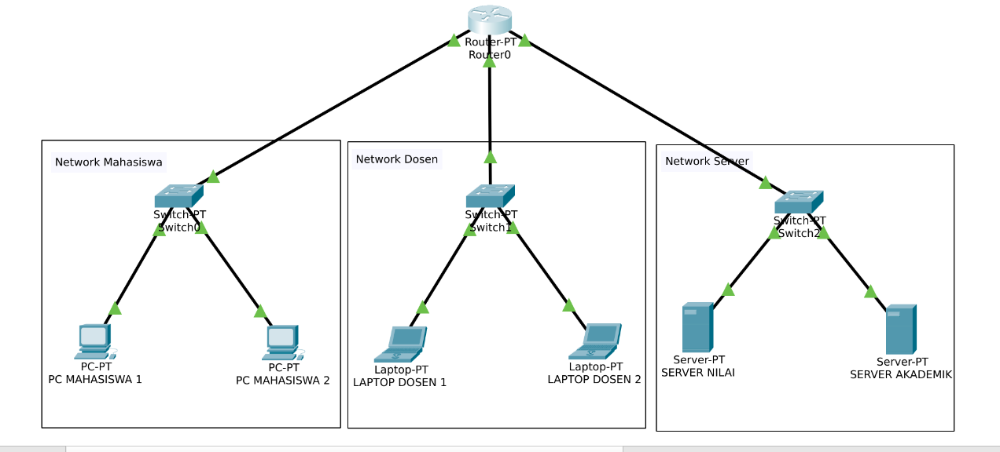

# 🏫 Simulasi Jaringan Kampus dengan ACL (Cisco Packet Tracer)

Simulasi jaringan kampus sederhana yang menerapkan **Access Control List (ACL)** untuk membatasi akses antar-segmen (Mahasiswa, Dosen, Server), dibangun **full CLI** menggunakan Cisco IOS di Cisco Packet Tracer.

## 📌 Latar Belakang

Proyek ini dibuat sebagai latihan praktik langsung (bukan sekadar teori) untuk memahami:
- Subnetting & VLSM (Variable Length Subnet Mask)
- Konfigurasi router & interface via CLI (bukan GUI)
- Access Control List (ACL) — extended, permit/deny, wildcard mask
- Debugging jaringan secara sistematis

## 🗺️ Topologi



**1 Router, 3 Switch, 3 Segmen:**

| Segmen | Perangkat |
|---|---|
| Network Mahasiswa | PC Mahasiswa 1, PC Mahasiswa 2 |
| Network Dosen | Laptop Dosen 1, Laptop Dosen 2 |
| Network Server | Server Nilai, Server Akademik |

## 🔢 Rancangan IP (VLSM)

Alokasi dari blok `192.168.20.0/24`, dibagi sesuai kebutuhan host tiap segmen:

| Segmen | Subnet Mask | Network Address | Range Host | Broadcast | Gateway |
|---|---|---|---|---|---|
| Network Mahasiswa | /27 | 192.168.20.0 | 192.168.20.1 – 192.168.20.30 | 192.168.20.31 | 192.168.20.3 |
| Network Dosen | /28 | 192.168.20.32 | 192.168.20.33 – 192.168.20.46 | 192.168.20.47 | 192.168.20.34 |
| Network Server | /29 | 192.168.20.48 | 192.168.20.49 – 192.168.20.54 | 192.168.20.55 | 192.168.20.50 |

**Detail server:**
- `192.168.20.49` → Server Nilai
- `192.168.20.50` → Server Akademik *(sekaligus gateway interface Fa6/0 di konfigurasi ini)*

## 🔐 Skenario Access Control List (ACL)

Aturan akses yang diterapkan:

| Aturan | Status |
|---|---|
| Mahasiswa **boleh** akses Server Akademik | ✅ Allowed |
| Mahasiswa **tidak boleh** akses Server Nilai | ⛔ Blocked |
| Mahasiswa **tidak boleh memulai** ping ke Network Dosen | ⛔ Blocked |
| Dosen tetap bisa ping ke Mahasiswa (dan menerima balasannya) | ✅ Allowed |
| Dosen bebas akses kedua server | ✅ Allowed |

### Konfigurasi ACL (Extended, nomor 100)

```
access-list 100 deny ip 192.168.20.0 0.0.0.31 host 192.168.20.49
access-list 100 deny icmp 192.168.20.0 0.0.0.31 192.168.20.32 0.0.0.15 echo
access-list 100 permit ip any any
```

Diterapkan di interface yang menghadap Network Mahasiswa:
```
interface FastEthernet0/0
 ip access-group 100 in
```

> **Catatan penting:** Baris kedua sengaja menambahkan keyword `echo` agar hanya memblokir *ICMP Echo Request* (permintaan ping yang dimulai Mahasiswa), bukan *Echo Reply* (balasan). Tanpa `echo`, arah sebaliknya (Dosen → Mahasiswa) ikut terblokir karena ACL bersifat **stateless** — detail lengkap ada di `panduan-acl-cisco.md`.

## ✅ Hasil Pengujian

Semua skenario di atas sudah diuji dan tervalidasi langsung di Packet Tracer, termasuk verifikasi lewat `show access-lists` (match counter) dan uji ping bertahap (per-subnet, lintas-subnet, dua arah).

## 📖 Resource Tambahan

Tersedia juga `panduan-acl-cisco.md` di repository ini — sebuah catatan bantuan yang dibuat dengan AI untuk memudahkan pemahaman konsep ACL.

## 🎯 Tujuan Pembelajaran

Proyek ini bagian dari proses belajar mandiri menuju bidang **Cybersecurity — Digital Forensics**, dengan fokus membangun fondasi jaringan komputer yang kuat (IP addressing, subnetting, routing, ACL) sebelum masuk ke topik keamanan yang lebih lanjut (port security, IDS/IPS, packet analysis).

---

*Dibangun 100% menggunakan CLI Cisco IOS (tanpa GUI), sebagai bagian dari latihan praktik mandiri.*
